# Health App Screenshots

This repository contains screenshots of the Health App, which is designed to promote health and wellness through various features such as dietary guidelines, step tracking, BMI calculation, and more.

## App Guide Video
You can watch the app guide video [here](https://github.com/ankitk75/Health-App/raw/master/Screenshots/appGuide.mp4).

## Screenshots

Below are the screenshots of different screens in the Health App, along with descriptions for each:

### 1. Opening Screen
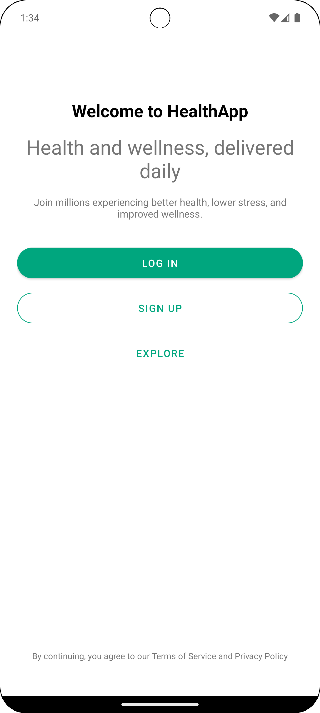
*The home screen provides users with an overview of their health statistics and quick access to key features like dietary guidelines, step tracking, and user assessments.*

### 2. Sign Up
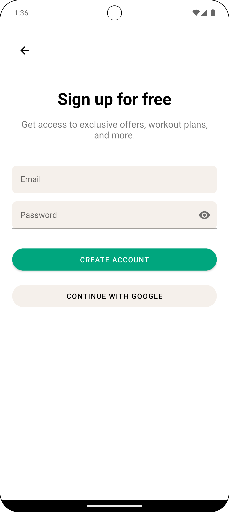

### 3. Log In
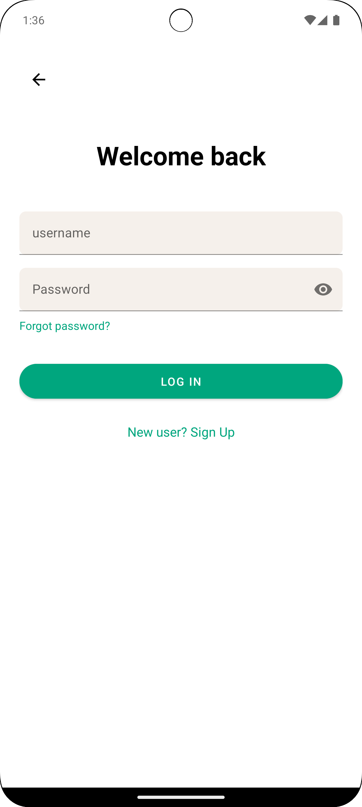

### 4. Home Screen
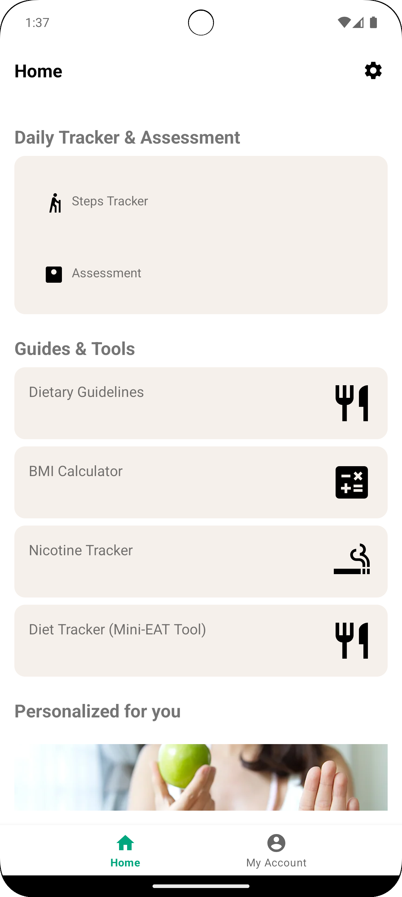
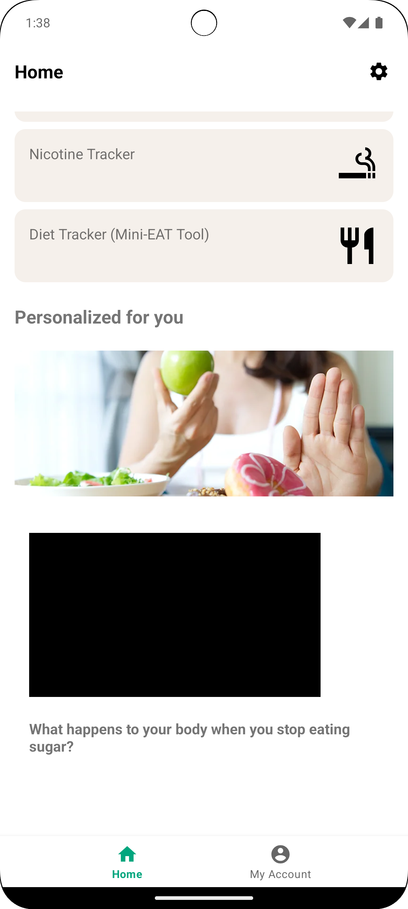

### 5. User Profile
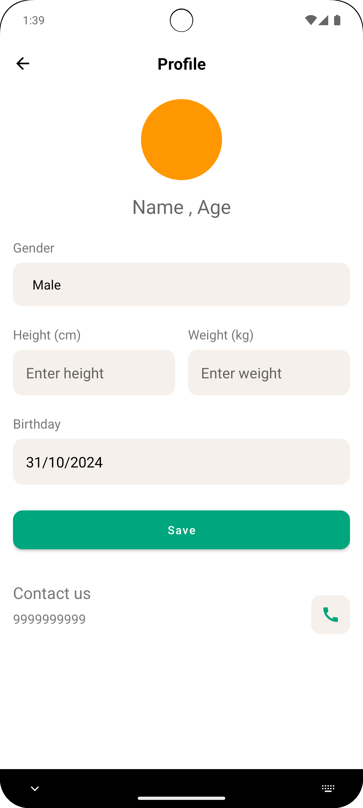
*The user profile screen allows users to manage their personal information, including weight, height, and fitness goals. This information is used to tailor recommendations.*

### 6. Step Tracking
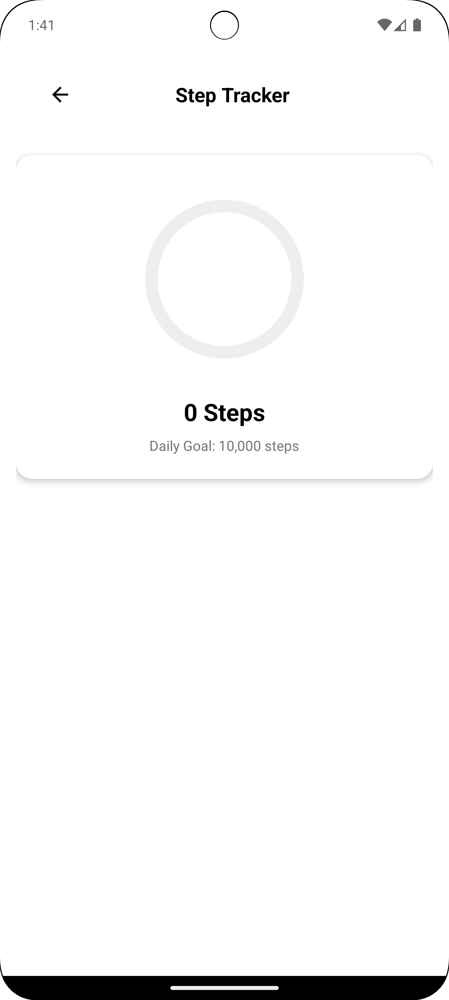
*The step tracking feature shows users their daily steps and activity levels, encouraging them to meet their fitness goals.*

### 7. Assessments
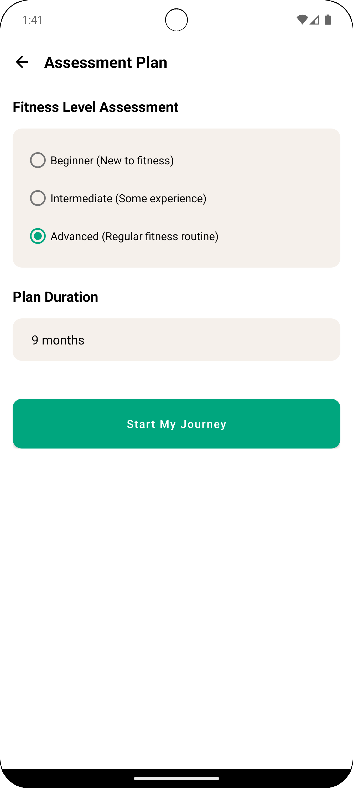

## 7.1. Notifications
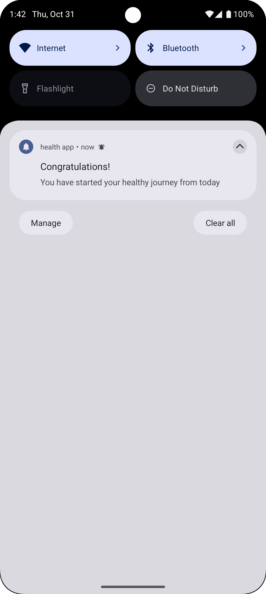
*The assessments screen includes various health-related quizzes and surveys to help users monitor their wellness and make informed decisions.*

### 8. Dietary Guidelines
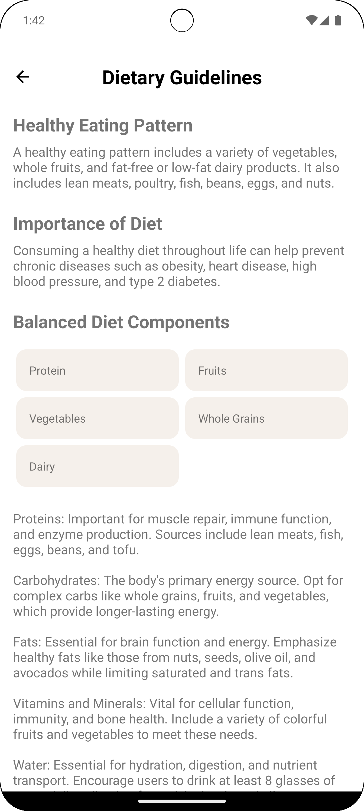
*This screen displays personalized dietary recommendations based on the user's profile and preferences, helping them make healthier food choices.*

### 9. BMI Calculation
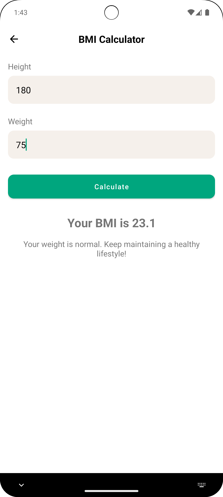
*The BMI calculator allows users to calculate their Body Mass Index based on their height and weight, providing insights into their health status.*

### 10. Nicotine Tracker
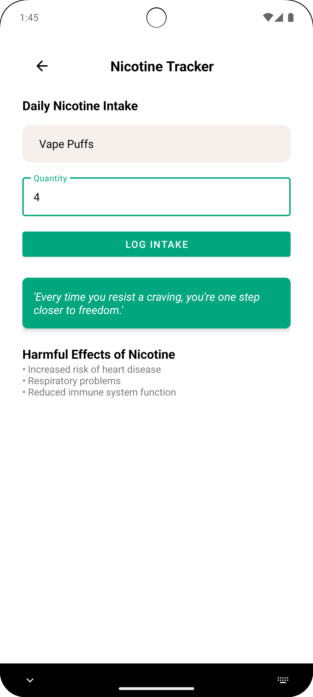

### 11. Nicotine Tracker
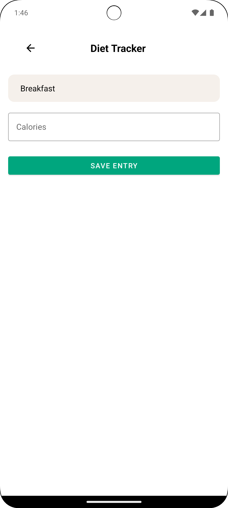

### 11. Video Play
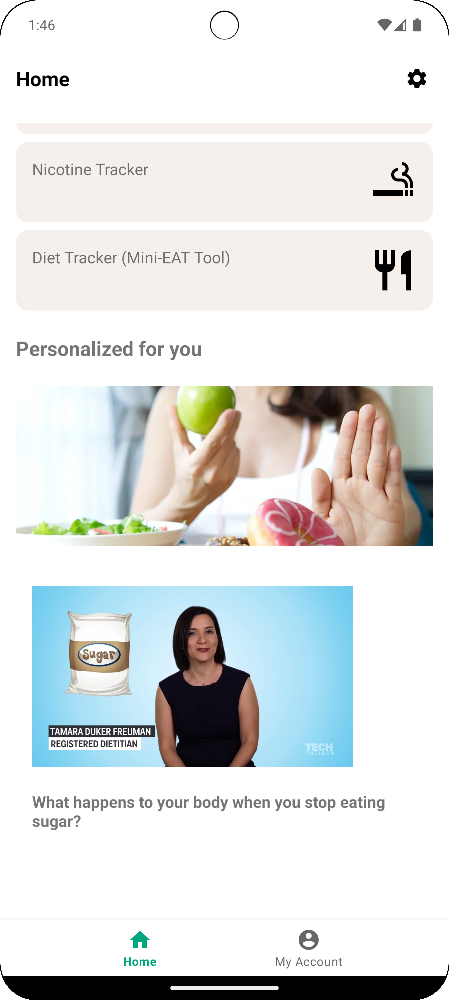

## Conclusion

The Health App aims to enhance users' health and wellness by providing them with essential tools and information. Each screen is designed to be user-friendly and informative, making it easier for users to manage their health.

Feel free to explore the repository for the full code and implementation details!
